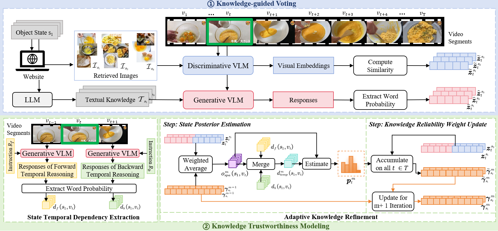

# What-to-Trust
This repository contains code for the paper [What to Trust? A Trust-aware Knowledge-guided Method for Zero-shot Object State Understanding in Videos](https://github.com/MNOPQYY/What-to-Trust/blob/main/Paper.pdf).

### 🚀 **News**
- [Jan 2026] We released the code of our method.
- [Nov 2025] Our paper has been accepted for **AAAI 2026🎉**

### To-Do List
- [ ] Release the evaluation code.
- [ ] Update an instruction for code running.
